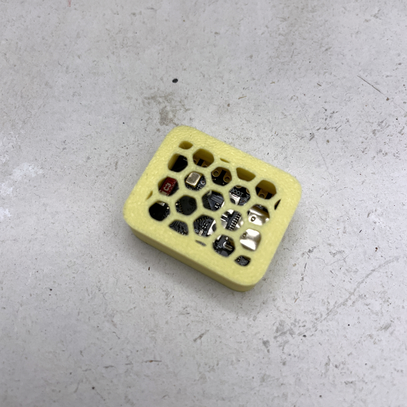

# ESP32-C3 Starch Miner Lite

A lightweight ESP32-C3 based miner for the [Starch blockchain](https://starch.one). This project runs on ESP32-C3 hardware and continuously mines blocks by fetching the latest blockchain hash and submitting new blocks to the Starch API.



## Features

- **Blockchain Mining**: Automatically fetches the latest blockchain hash and submits new blocks
- **WiFi Connectivity**: Connects to WiFi network with automatic reconnection support
- **LED Status Indication**: Uses built-in LED to indicate device status
- **Serial Monitoring**: Full debug output via Serial (115200 baud)
- **Lightweight**: No filesystem, webserver, or display dependencies - minimal footprint

## Hardware Requirements

- **ESP32-C3-DevKitM-1** development board
- USB cable for programming and power
- WiFi network access

## Prerequisites

- [PlatformIO](https://platformio.org/) installed (VS Code extension or CLI)
- USB drivers for ESP32-C3 (usually included with PlatformIO)

## Setup Instructions

### 1. Clone the Repository

```bash
git clone https://github.com/MadOrkestra/StarchMinerLite
cd ESP32-C3-StarchMinerLite
```

### 2. Configure Secrets

Copy the example secrets file and fill in your configuration:

```bash
cp src/secrets.h.example src/secrets.h
```

Edit `src/secrets.h` with your actual values:

```cpp
String CONFIG_MINER_ID = "YOUR_MINER_ID";      // Your Starch miner ID
String CONFIG_MINER_COLOR = "#FF0000";         // Miner color (hex format, e.g., #FF0000 for red)
String CONFIG_WIFI_SSID = "your_wifi_ssid";    // Your WiFi network name
String CONFIG_WIFI_PASSWORD = "your_password"; // Your WiFi password
```

**Important**: `secrets.h` is excluded from git via `.gitignore` - your sensitive information will not be committed.

### 3. Build and Upload

Using PlatformIO CLI:

```bash
# Build the project
pio run

# Upload to device
pio run --target upload

# Monitor serial output
pio device monitor
```

Or using PlatformIO VS Code extension:

- Click the PlatformIO icon in the sidebar
- Click "Build" to compile
- Click "Upload" to flash the device
- Click "Monitor" to view serial output

## How It Works

1. **Initialization**: On startup, the device:
   - Initializes serial communication
   - Loads configuration from `secrets.h`
   - Attempts to connect to WiFi

2. **Mining Loop**: Every 15 seconds (when WiFi is connected):
   - Fetches the latest blockchain hash from `api.starch.one`
   - Creates a new block by hashing: `lastHash + minerId + minerColor`
   - Submits the block to the Starch API
   - Tracks submitted block count (in-memory)

3. **WiFi Management**:
   - Automatically reconnects if WiFi disconnects (every 30 seconds)
   - LED indicates connection status (blinks during connection, solid when connected)

## Project Structure

```
ESP32-C3-StarchMinerLite/
├── include/              # Header files
│   ├── config.h         # Configuration interface
│   ├── miner.h          # Mining functions
│   ├── pins.h           # Pin definitions
│   ├── version.h        # Version management
│   └── wifi_manager.h   # WiFi management
├── src/                 # Source files
│   ├── main.cpp         # Main program entry point
│   ├── config.cpp       # Configuration implementation
│   ├── miner.cpp        # Mining logic and SHA-256
│   ├── wifi_manager.cpp # WiFi connection management
│   ├── version.cpp      # Version functions
│   ├── secrets.h        # Your secrets (gitignored)
│   └── secrets.h.example # Secrets template
├── partitions.csv       # Flash partition table
├── platformio.ini       # PlatformIO configuration
└── README.md           # This file
```

## Configuration

All configuration is done in `src/secrets.h`:

- **CONFIG_MINER_ID**: Your unique Starch miner identifier
- **CONFIG_MINER_COLOR**: Color associated with your miner (hex format, e.g., `#FF0000` for red)
- **CONFIG_WIFI_SSID**: WiFi network name
- **CONFIG_WIFI_PASSWORD**: WiFi network password

## Serial Output

The device outputs detailed information via Serial at 115200 baud:

- Startup messages and initialization status
- WiFi connection status and IP address
- Mining operations (hash fetching, block creation, submission)
- Error messages and connection failures

Monitor serial output to debug issues or track mining activity.

## Block Mining Details

- **Hash Algorithm**: SHA-256
- **Block Creation**: `SHA256(lastHash + " " + minerId + " " + minerColor)`
- **API Endpoint**: `https://api.starch.one`
- **Update Interval**: 15 seconds
- **Block Tracking**: In-memory counter (resets on reboot)

## Troubleshooting

### Device won't connect to WiFi

- Verify SSID and password in `secrets.h`
- Check WiFi signal strength
- Monitor serial output for connection errors

### No blocks being submitted

- Verify WiFi is connected (check serial output)
- Confirm miner ID is correct
- Check API endpoint is accessible
- Monitor serial for API response errors

### Build errors

- Ensure PlatformIO is up to date: `pio upgrade`
- Clean build: `pio run --target clean`
- Verify all dependencies are installed

### Upload fails

- Check USB cable connection
- Press and hold BOOT button during upload
- Try different USB port
- Verify correct board selected in `platformio.ini`

## Dependencies

- **ArduinoJson** (v7.4.2): JSON parsing for API communication
- **ESP32 Arduino Framework**: Core ESP32 support

## License

Licensed under the Apache License, Version 2.0 (the "License");
you may not use this file except in compliance with the License.
You may obtain a copy of the License at

    http://www.apache.org/licenses/LICENSE-2.0

Unless required by applicable law or agreed to in writing, software
distributed under the License is distributed on an "AS IS" BASIS,
WITHOUT WARRANTIES OR CONDITIONS OF ANY KIND, either express or implied.
See the License for the specific language governing permissions and
limitations under the License.

## Support

For issues and questions, please open an issue on the repository.
